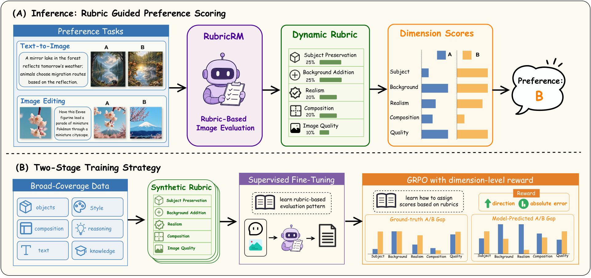

# RubricRM: Generative Reward Modeling via Dynamic Rubrics for Image Generation and Editing

Official repository for the paper *RubricRM: Generative Reward Modeling via Dynamic Rubrics for Image Generation and Editing*. 

<p align="center">
  
</p>

## Models and Data

RubricRM provides four SkyJM checkpoints for evaluating text-to-image generation and image editing at two model scales.

| Task | 4B | 9B |
| --- | --- | --- |
| Text-to-image generation | [](https://huggingface.co/skylenage-ai/SkyJM-Gen-4B) | [](https://huggingface.co/skylenage-ai/SkyJM-Gen-9B) |
| Image editing | [](https://huggingface.co/skylenage-ai/SkyJM-Edit-4B) | [](https://huggingface.co/skylenage-ai/SkyJM-Edit-9B) |

The training data used by RubricRM are available on Hugging Face:

[](https://huggingface.co/datasets/skylenage-ai/RubricRM-Data)

## Quick Start

### Installation

**Inference** (lightweight, vLLM-based):

```bash
pip install vllm transformers pillow numpy qwen-vl-utils
```

**Training** (verl framework with FSDP / Megatron-LM):

```bash
cd verl
pip install -e .
pip install -r requirements.txt
```
### Inference

```bash
cd inference
bash run_inference.sh
```

### Grading

```bash
# A/B preference accuracy
python inference/grade_single.py output/result.jsonl

# EditScore-Bench (multi-dimension)
python inference/grade_editscore_bench.py output/editscore_result.jsonl

# EditReward-Bench (2/3/4-pair)
python inference/grade_reward_bench.py output/editreward_result.jsonl
```

## Training

```bash
cd verl
bash train.sh
```
